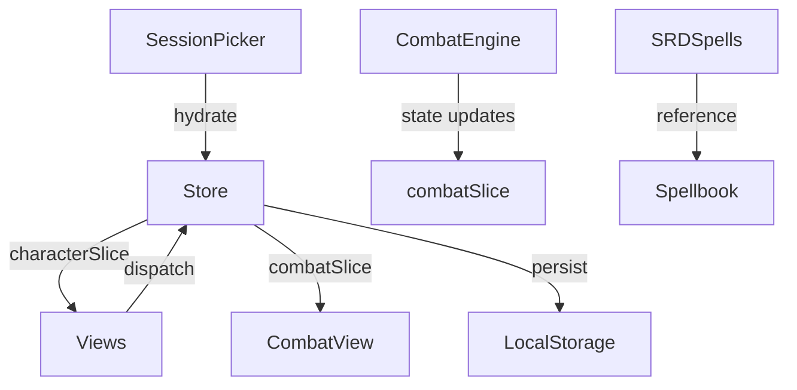

# Architecture

> Generated by /map on 2026-01-19

## Overview

**Aramancia Tracker** is a D&D 5e character sheet and combat management PWA. It tracks character stats, spell slots, minions (undead summons), familiars, and combat state with strict adherence to SRD 5.1 rules.

```
┌─────────────────────────────────────────────────────────────┐
│                      SessionPicker                          │
│              (Session Management / Hydration)               │
├─────────────────────────────────────────────────────────────┤
│                           App.tsx                           │
│                  (Routing + View Switching)                 │
├─────────────────────────────────────────────────────────────┤
│ CharacterView │ CombatView │ GrimoireView │ InventoryView  │
│  RestView     │ StatsView  │ BiographyView│ RolePlayView   │
├─────────────────────────────────────────────────────────────┤
│                        Widgets (25)                         │
│  HealthWidget │ SpellSlotsWidget │ MinionBubble │ ...      │
├─────────────────────────────────────────────────────────────┤
│                     Redux Store (4 slices)                  │
│       characterSlice │ combatSlice │ spellbookSlice        │
├─────────────────────────────────────────────────────────────┤
│                  Engine / Business Logic                    │
│         combatEngine │ derivedStats                         │
├─────────────────────────────────────────────────────────────┤
│                     Data Layer                              │
│    SRD 5.2 Spells (JSON) │ Undead Stats │ Familiar Stats   │
└─────────────────────────────────────────────────────────────┘
```

## Components

### Views (`src/components/views/`)

| View | Purpose | Size |
|------|---------|------|
| `CharacterView` | Main character sheet display | 9.7KB |
| `CombatView` | Combat management + minion control | 27KB |
| `GrimoireView` | Spellbook browsing + preparation | 7.7KB |
| `InventoryView` | Item and attunement management | 8KB |
| `RestView` | Short/Long rest processing | 10KB |
| `StatsView` | Ability scores + skills editing | 9.3KB |
| `BiographyView` | Character lore + backstory | 6.1KB |
| `RolePlayView` | RP tools + notes | 10KB |
| `CombatOverlay` | Combat HUD overlay | 7.2KB |

### Widgets (`src/components/widgets/`)

Key UI building blocks (25 total):

| Widget | Purpose |
|--------|---------|
| `HealthWidget` | HP/THP management with damage/heal controls |
| `SpellSlotsWidget` | Spell slot tracking with orb indicators |
| `SlotAbacus` | Multiclass spell slot calculator |
| `MinionBubble` | Floating minion management button |
| `FamiliarBubble` | Floating familiar management button |
| `CombatBubble` | Combat actions floating button |
| `ConcentrationWidget` | Active concentration spell display |
| `ArmorClassWidget` | AC calculation with Mage Armor/Shield |
| `HitDiceWidget` | Hit dice tracking for rests |
| `DeathSavesWidget` | Death saving throw tracker |
| `ArcaneRecoveryModal` | Wizard Arcane Recovery feature |

### Features (`src/components/features/`)

Domain-specific feature modules:

| Feature | Contents |
|---------|----------|
| `combat/` | QuickActionsWidget, MinionCard, VirtualMinionList, MathStrip |
| `spells/` | SpellCard, Spellbook, SpellFilters |
| `warlock/` | (Empty - future Warlock support) |

### Store (`src/store/`)

Redux Toolkit state management:

| Slice | Purpose | Size |
|-------|---------|------|
| `characterSlice` | Core character state (HP, AC, abilities, spells, etc.) | 16.6KB |
| `combatSlice` | Combat state, minions, concentration | 9.2KB |
| `spellbookSlice` | Spell preparation and filtering | 2.2KB |
| `persistenceMiddleware` | localStorage session persistence | 2.2KB |

### Engine (`src/engine/`)

Business logic separated from UI:

| Module | Purpose |
|--------|---------|
| `combatEngine.ts` | Turn order, damage/healing, conditions (SRD 5.1 compliant) |
| `derivedStats.ts` | AC formulas, ability modifier calculations |

### Data (`src/data/`)

Static game data:

| File | Purpose |
|------|---------|
| `srd-5.2-spells.json` | Complete SRD spell database (354KB) |
| `undeadStats.ts` | Skeleton/Zombie stat blocks |
| `familiarStats.ts` | Find Familiar creature stats |
| `summonPrototypes.ts` | Summon Undead form stats |
| `spells.ts` | Legacy spell data |

## Data Flow



1. **SessionPicker** loads or creates a session
2. **`hydrate`** action populates Redux store from session data
3. **Views** consume state via `useAppSelector`
4. **Widgets** dispatch actions to modify state
5. **persistenceMiddleware** saves state to localStorage
6. **CombatEngine** handles turn-based combat logic

## Integration Points

| Service | Type | Purpose |
|---------|------|---------|
| localStorage | Storage | Session persistence |
| Capacitor | SDK | Android/iOS native wrapper |
| GitHub Pages | Hosting | Static deployment target |
| Playwright | Testing | E2E test automation |

## Conventions

**Naming:**

- PascalCase for components (`HealthWidget.tsx`)
- camelCase for utilities and slices (`characterSlice.ts`)
- Descriptive suffixes: `*View`, `*Widget`, `*Slice`, `*Engine`

**Structure:**

- Co-located feature code in `components/features/`
- Shared widgets in `components/widgets/`
- View-level components in `components/views/`
- Redux normalized in `store/slices/`

**Testing:**

- E2E tests in `e2e/` using Playwright
- Component tests in `src/tests/`
- Performance tests co-located (`.perf.test.tsx`)

## Technical Debt

- [ ] `CombatView.tsx:268` — "Hook up to turn logic" (end turn button)
- [ ] `InventoryView.tsx:22` — "UI for selecting spells" on items
- [ ] `QuickActionsWidget.tsx:60` — "Add feats support to CharacterState"
- [ ] `goldenFlows.test.tsx:191,194` — Wild Shape tests not implemented
- [ ] `warlock/` feature directory empty — Warlock class not yet supported
- [ ] Multiple log/error files in root (cleanup build artifacts)
